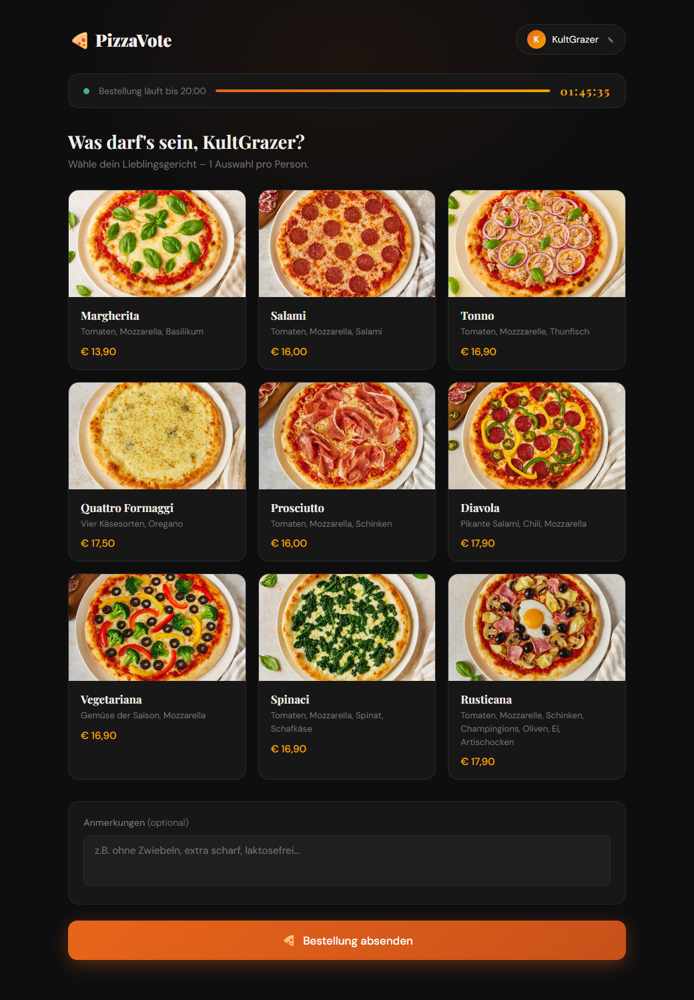
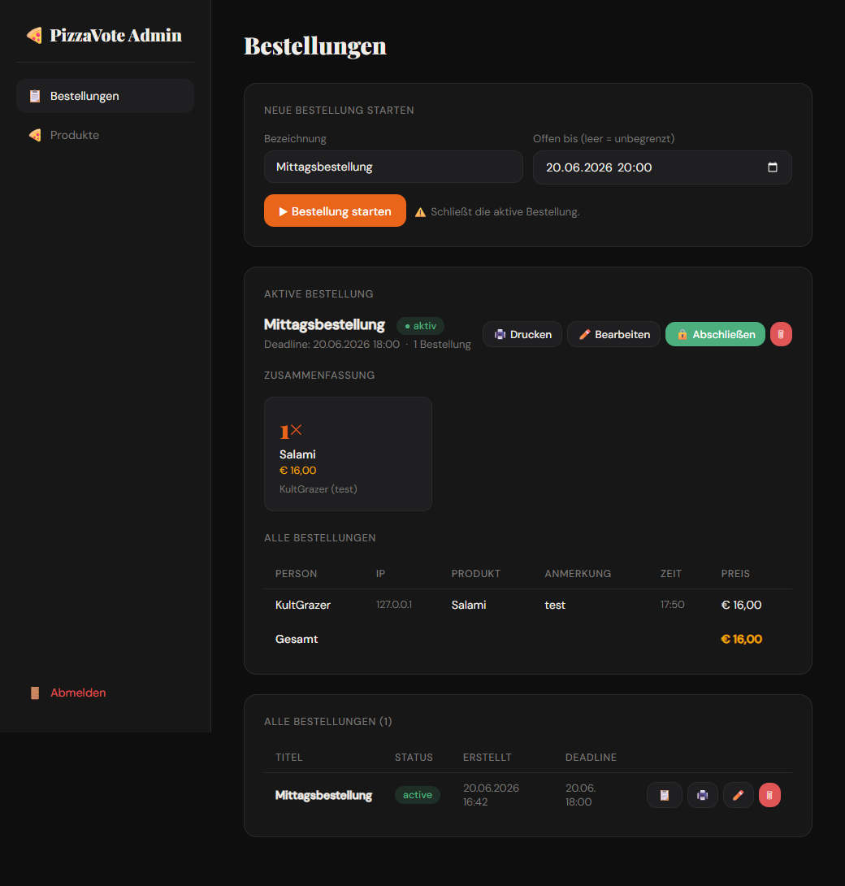
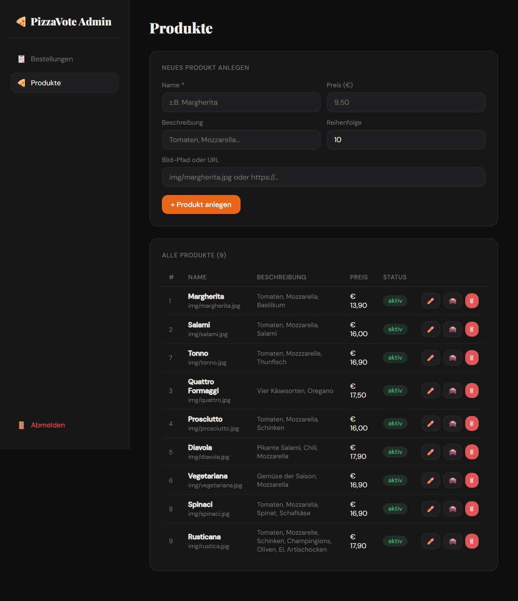

# PizzaVote – Setup

Zero-config PHP + SQLite web app for shared pizza orders on a local network (e.g. a LAN
party). No login for participants, no separate server (database, account system, etc.)
needed — just PHP. Participants are recognized automatically by their local IP address
(see ["How does user identification work?"](#how-does-user-identification-work) below).

## Screenshots

| Order page | Admin – Orders | Admin – Products |
|---|---|---|
|  |  |  |

## How does user identification work?

**Participants don't log in — they're identified automatically by their local IP
address** (`getClientIP()` in `index.php`, read from `HTTP_X_FORWARDED_FOR` /
`HTTP_CLIENT_IP` / `REMOTE_ADDR`):

- On first visit, you're asked once for a name.
- That name is stored together with the IP address in the `users` table (`ip` is
  `UNIQUE`) — **no** cookie, **no** `localStorage`, **no** password.
- On every later visit from the same IP, the user is recognized automatically.
- The name can be changed at any time (✎ icon at the top); the IP association stays
  the same.

**Good to know:**

- This works reliably as long as every device on the LAN gets its **own** IP via DHCP
  (the default behavior of almost every home router/hotspot).
- Devices **behind the same IP** (e.g. shared NAT/proxy) are treated as **one** person —
  the last saved selection wins.
- When testing locally from a single machine via `localhost`/`127.0.0.1`, **all**
  requests look like a single user. To test multi-user behavior, access the app via the
  host machine's real LAN IP from different devices (see "Quickstart" below).
- If a device's IP changes (e.g. new DHCP lease, different Wi-Fi), it shows up as a new
  user and is asked for a name again.

## Project structure

```
www/
├── config.php             ← Configuration: admin password, language, timezone, DB setup
├── i18n.php               ← Translation helper (function t())
├── lang/                  ← UI language files
│   ├── de.json
│   └── en.json
├── index.php              ← Frontend for all participants (IP-based, no login)
├── backend/
│   └── index.php          ← Admin panel (password-protected): orders + products
├── phpliteadmin/          ← Third-party tool for direct DB access (see Security!)
├── data/                  ← created automatically (SQLite DB: PizzaVote.db)
└── img/                   ← product photos (local files or external URLs in the DB)
    ├── margherita.jpg
    ├── salami.jpg
    └── ...
```

## Installation (own web server)

1. **Check PHP modules:**
   ```bash
   # Fedora / Nobara:
   sudo dnf install php php-pdo php-sqlite3

   # Debian / Ubuntu:
   sudo apt install php php-sqlite3
   ```

2. **Copy the files to your server** (e.g. `/var/www/html/bestellung/`)

3. **Make `data/` and `img/` writable:**
   ```bash
   mkdir data
   chmod 755 data img
   # or if needed:
   chown www-data:www-data data img
   ```

4. **Adjust `config.php`:**
   - Change `ADMIN_PASSWORD`!
   - Adjust the timezone if needed (default: Europe/Vienna)
   - Set `APP_LANG`: `'de'` or `'en'` (matching file must exist in `lang/`)

5. **Product photos**: put them in `img/` — or use URLs in the products instead.

6. **Done!** On first run, the database is created automatically and seeded with 9
   example products.

## Quickstart (test locally, no web server needed)

PHP's built-in server is plenty for a LAN party:

```bash
cd www
# If the pdo_sqlite extension is disabled in the global php.ini,
# enable it just for this one process (no system file changes needed):
php -d extension=pdo_sqlite -S 0.0.0.0:8000
```

- Bind to `0.0.0.0` instead of `localhost` so the app is reachable from other devices on
  the same network (see the IP-identification section above — this is required for
  multi-user operation).
- Find your local IP: `ipconfig | findstr IPv4` (Windows) or `ip addr | grep inet`
  (Linux/Mac).
- Then share `http://<local-ip>:8000` with everyone on the same network.

## Usage

- **Frontend:** `http://<server-ip>:<port>/`
- **Backend:** `http://<server-ip>:<port>/backend/` — log in with `ADMIN_PASSWORD` from
  `config.php`

### Admin features (backend)

- **Orders**: start a new one (with optional deadline), edit, close, reactivate, delete;
  summary with total per person; print view
- **Products**: create, edit, activate/deactivate, delete
- **Product photo**: enter a path/URL manually OR upload an image file
  (JPG/PNG/GIF/WEBP) — automatically cropped/resized to 800×600. Stays unchanged if
  nothing new is uploaded while editing.

## Multilingual support

The interface (labels, buttons, messages) supports German and English:

- The language is chosen **statically** via `define('APP_LANG', 'de');` in `config.php`
  — there's no language switcher for end users in the UI.
- To add a new language: create `lang/<code>.json` with the same keys as
  `lang/de.json` — see **[TRANSLATIONS.md](TRANSLATIONS.md)** for a step-by-step guide
  (no PHP knowledge needed, contributions welcome!).
- **Not** translated: product names, descriptions, and comments — they stay exactly as
  entered in the database/admin panel.

## Security

- **Change `ADMIN_PASSWORD`** — the default value is only a placeholder.
- **Don't expose this to the public internet.** This app is meant as a pure LAN
  solution (no CSRF protection, simple session login). Already observed in the wild: an
  automated SQL injection attempt via the name field from a public IP — harmless thanks
  to consistent use of PDO prepared statements, but proof that an open port gets found
  and probed by bots.
- The `data/` folder should not be directly reachable via `.htaccess` or web server
  config:
  ```apache
  # .htaccess in data/
  Deny from all
  ```
- **`phpliteadmin/`** allows direct database access over the web and currently still
  uses the **default password `admin`** (`phpliteadmin.config.php`, the `$password`
  line) — a publicly known default credential. **Change it before any real use**, or
  remove the folder entirely if you don't need it.

## Credits

UI icons are from [Tabler Icons](https://tabler.io/icons) (MIT license) — see
[THIRD_PARTY_LICENSES.md](THIRD_PARTY_LICENSES.md).

## License

MIT — see [LICENSE](LICENSE).
